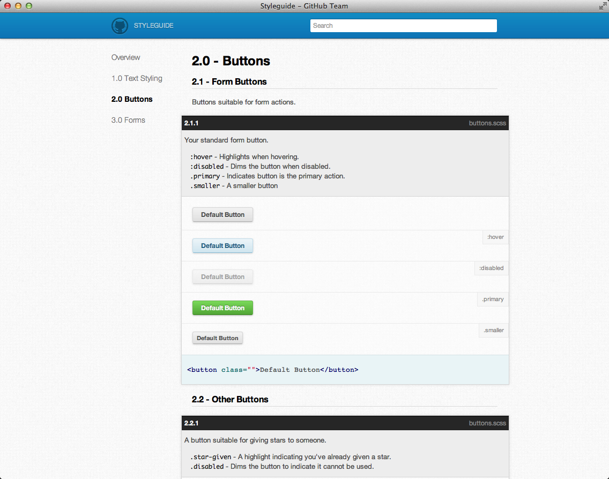

Living Style Guides
===================

Living Style Guides sind aus CSS-Dateien generierte Styleguides.

Vorteile
--------

Konsistenz
 Die generierten Styleguides stimmen exakt mit der Code-Basis überein. Testbarkeit
 Mit einem einheitlichen Styleguide wird sehr schnell deutlich, an welchen
 Stellen das Design Brüche aufweist, da die verschiedenen Komponenten einfach
 auf verschiedene Rasterweiten, Ausgabegeräte, Browser etc. überprüft werden
 können.
Verbesserte Zusammenarbeit
 Ein generierter Styleguide gibt einen Überblick über das gesamte
 Erscheinungsbild einer Site, nicht nur einer einzelnen HTML-Seite. Damit
 lassen sich viel einfacher die relevanten Gestaltungsregeln angeben.
Gemeinsames Vokabular
 Das gemeinsame Vokabular, das sich aus den Namen der Komponenten ergibt,
 verbessert die Verständigung zwischen Kunden, Designern und Web-Entwicklern.
Referenz
 Eine generierter Styleguide ist auch für die Redakteure der Site hilfreich,
 da sie einen vollständigen Überblick über die möglichen Auszeichnungen
 erhalten.

Prozess
-------

 Dont’t build pages, build a system of components!

– Fiona Chan, 28. März 2013

Wie sieht unser Design-Prozess nun im Einzelnen aus:

#. Analyse der Website

   - Typographie
   - Links
   - Listen
   - Boxen und Hintergrund
   - Buttons

.. grid:: 2

    .. grid-item-card::

        .. image:: living-styleguide-buttons.png
            :alt: Buttons

    .. grid-item-card::

        .. image:: living-styleguide-forms.png
            :alt: Formulare

#. Erstellen der Komponenten

   Hier das Beispiel des `GitHub CSS Styleguide
   <https://github.com/styleguide/css>`_:

   .. code-block:: console

    styles
    ├── components
    │   ├── comments.scss
    │   └── listings.scss
    ├── globals
    │   ├── browser_helpers.scss
    │   ├── responsive_helpers.scss
    │   ├── variables.scss
    ├── plugins
    │   ├── jquery.fancybox-1.3.4.css
    │   └── reset.scss
    ├── sections
    │   ├── issues.scss
    │   ├── profile.scss
    └── shared
        ├── forms.scss
        └── markdown.scss

#. Pflege

   Da die CSS-Dateien, aus denen der Styleguide generiert wird,
   in einem Versionsverwaltungssystem gespeichert werden, lassen sich
   Aktualisierungen sehr kontrolliert durchführen.

   Auch das umfassende Testen der CSS-Dateien mit neuen Ausgabegeräten und
   Browsern wird deutlich vereinfacht.

.. seealso::
   * `Fiona Chan: How to create a living style guide
     <https://speakerdeck.com/mobywhale/how-to-create-a-living-style-guide>`_
   * `Natalie Downe: CSS Systems for writing maintainable CSS
     <http://de.slideshare.net/nataliedowne/css-systems-presentation>`_
