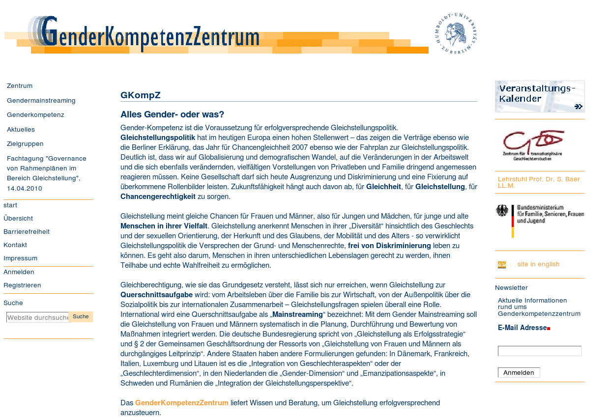

Relaunch der Website des GenderKompetenzZentrum
===============================================

Migration der Website des GenderKompetenzZentrum nach Plone.

Neben der Überführung der bestehenden Artikel der Website des
`GenderKompetenzZentrum <http://www.genderkompetenz.info/>`_ wurde auch die
Expertise-Datenbank aktualisiert, in der Interessierte detailliert nach
Beraterinnen und Beratern zu Gender Mainstreaming suchen können.

Insgesamt umfasste der Auftrag folgende Aufgaben:

#. Projektleitung
#. Anpassung der Plone-Site
#. Migration der bestehenden Artikel nach Plone
#. Software-Entwicklung für die Expertise-Datenbank
#. Installation
#. Schulung der Mitarbeiterinnen und Mitarbeiter des GenderKompetenzZentrum
