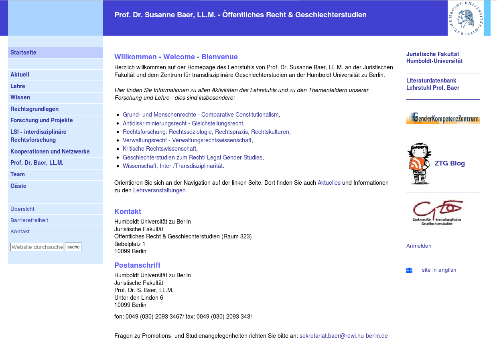

Relaunch der Website des Lehrstuhls von Prof. Dr. Susanne Baer
==============================================================

Wir migrierten die Website des des Lehrstuhls von Prof. Dr. Susanne Baer zu
einer aktuellen Plone-Site.

Zusammen mit meinem Partner Andreas Jung von `ZOPYX`_ migrierten wir die Website
des `Lehrstuhls von Prof. Dr. Susanne Baer`_ nach Plone. Neben der Überführung
der bestehenden Artikel wurde auch die Urteilsdatenbank aktualisiert, in der
Interessierte detailliert nach Urteilen suchen können wobei die Volltextsuche
eingeschränkt werden kann durch Länder, Rechtsquellen und Aktenzeichen.

Insgesamt umfasste der Auftrag folgende Aufgaben:

#. Projektleitung
#. Anpassung der Plone-Site
#. Migration der bestehenden Artikel nach Plone
#. Software-Entwicklung für die Urteilsdatenbank
#. Installation
#. Schulung der Mitarbeiterinnen und Mitarbeiter des Lehrstuhls von Prof. Dr. Susanne Baer

.. _`zopyx`: http://www.zopyx.com
.. _`Lehrstuhls von Prof. Dr. Susanne Baer`: http://baer.rewi.hu-berlin.de/
