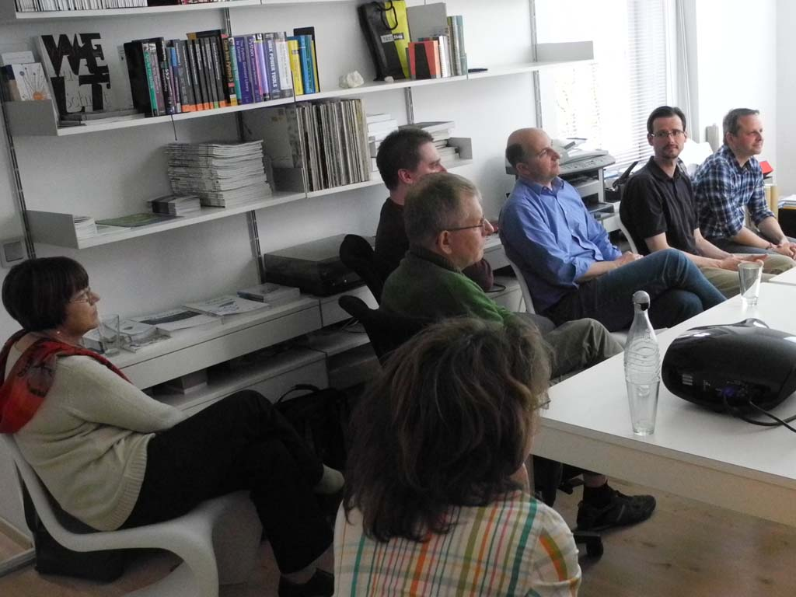

World Plone Day 2013 am 24. April in Berlin
===========================================

Zum World Plone Day 2013 am Mittwoch dem 24. April waren alle Interessierten herzlich eingeladen, mit uns an diesem Tag die neuesten Entwicklungen rund um das Content Management System Plone zu erkunden.

Der WorldPloneDay  war mit 15 Personen gut besucht und die folgenden Themen fanden reges Interesse:

Was ist neu in Plone 4.3?
 Plone 4.3 brint weitere Erleichterungen in der Bedienbarkeit:

 - `erweiterte Syndizierung
   <http://www.plone-nutzerhandbuch.de/einleitung.html#erweiterte-syndizierung>`_
 - `In-Plone Theme-Editor
   <http://www.plone-nutzerhandbuch.de/einleitung.html#in-plone-theme-editor>`_
 - `aktualisierter WYSIWYG-Editor
   <http://www.plone-nutzerhandbuch.de/einleitung.html#aktualisierter-wysiwyg-editor>`_

 Und auch für Plone-Entwickler vereinfachte sich einiges:

 - Das `Dexterity Content-Type-Framework
   <http://www.plone-entwicklerhandbuch.de/plone-entwicklerhandbuch/dexterity-artikeltypen>`_ ist nun im Standardumfang enthalten
 - `API für die Passwort-Validierung
   <http://ploneapi.readthedocs.org/en/latest/_modules/plone/api/user.html>`_
 - z3c.form-Unterstützung für plone.app.portlets
 - Zusätzliche ``body``-CSS-Klassen vereinfachen die kontextabhängige Gestaltung
   von Seiten.

Unicode-IDs in Zope
 Ein Kunde von uns hatte in einer Plone-Site mit `Reflecto
 <https://pypi.python.org/pypi/Products.Reflecto/>`_ die Schwierigkeit, dass
 Dateien mit Unicode-Namen nicht angezeigt wurden. Dieses Problem haben wir nun
 behoben mit `experimental.utf8id
 <https://github.com/wichert/experimental.utf8id>`_. Es gibt in Plone jedoch
 weitere Validatoren für die Objekt-IDs, die nun z.T. korrigiert wurden.

 Mehr: `UTF-8-URLs <https://utf8url.veit-schiele.de/>`_

XMPP-Integration in Plone
 Für das Intranet eines unserer Kunden haben wir als ersten XMPP-Service
 einen Chat realisiert, in dem sich Mitarbeiter schnell in Plone zu bestimmten
 Aufgaben austauschen können.

 Zukünftig soll über das XMPP-Protokoll auch das gemeinsame Editieren von
 Dokumenten in Echtzeit realisiert und so eine bessere Zusammenarbeit der
 Mitarbeiter ermöglicht werden.

 Mehr:

 - `Plone-Entwicklerhandbuch: XMPP
   <http://www.plone-entwicklerhandbuch.de/plone-entwicklerhandbuch/ausblick/xmpp/>`_

 .. `Plone Site <http://dev1.veit-schiele.de:8083/>`_
 .. `ejabberd <http://dev1.veit-schiele.de:5280/admin/>`_

`Diazo-Bootstrap-Framework <https://github.com/veit/diazo_bootstrap>`_ und `vs.bootstrap.plonetheme <https://pypi.python.org/pypi/vs.bootstrap.plonetheme>`_
 `Diazo <http://docs.diazo.org/en/latest/index.html>`_ ist ein XSLT-Server, der
 die Gestaltung beliebiger Web-Anwendungen erlaubt. Er erlaubt auch die
 Integration von Inhalten verschiedener Web-Anwendungen auf einer Seite. Damit
 ist er z.B. ideal für Intranets geeignet, in denen hochspezialisierte
 Anwendungen mit einem einheitlichen Look & Feel integriert werden sollen.
 `Twitter Bootstrap <http://twitter.github.com/bootstrap/>`_ ist ein Frontend-
 Framework für effizient und einfach zu bedienende Web-Anwendungen.

 Mehr: `Diazo-Bootstrap-Framework veröffentlicht <http://www.veit-schiele.de/news/diazo-bootstrap-framework-veroeffentlicht>`_

Datenschutzkonformes Web-Hosting
 Wir haben in unserem Hosting-Angebot in letzter Zeit einige Maßnahmen
 getroffen, sodass wir nun den Erfordrnissen des deutschen
 `Bundesdatenschutzgesetz <http://de.wikipedia.org/wiki/Bundesdatenschutzgesetz>`_ (BDSG) noch besser
 genügen.

 Mehr: `Verbesserte Umsetzung des Bundesdatenschutzgesetz in unserem Hosting-Angebot
 <http://www.veit-schiele.de/news/verbesserte-umsetzung-des-bundesdatenschutzgesetz-in-unserem-hosting-angebot>`_

Schließlich wurden beim Buffet die Diskussionen bis in die Abendstunden weitergeführt.
