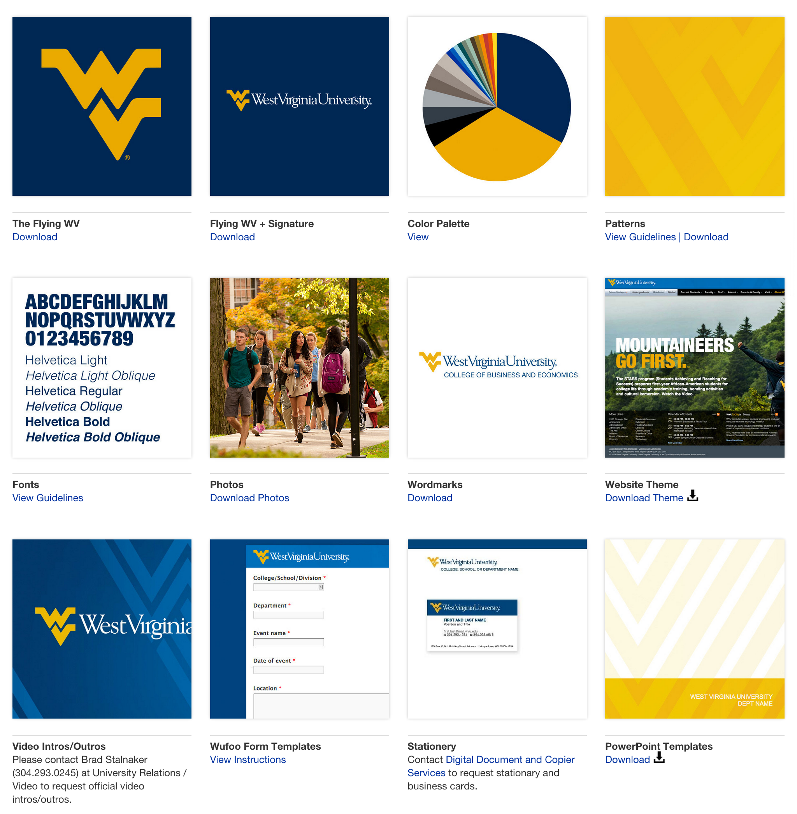
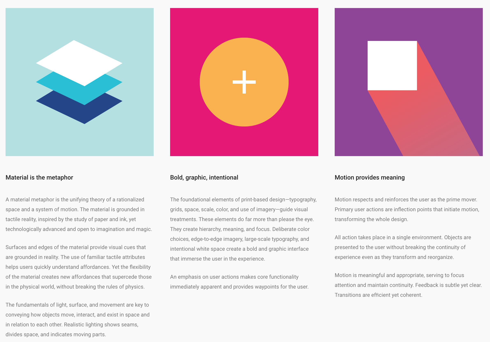
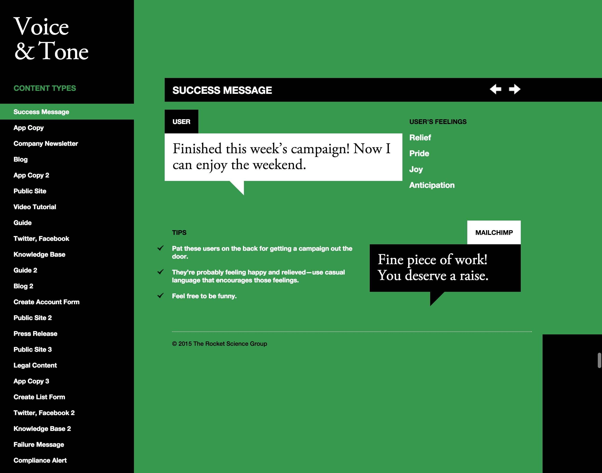

Agiles Design
=============

Styleguides und Musterbibliotheken  sind wesentliche Werkzeuge um Web-Teams bei
Multi-Device Websites zu unterstützen.

Die Vorteile von Styleguides sind vielfältig:

* sie schaffen eine gemeinsame Sprache
* sie erleichtern das Testen
* sie erstellen eine nützliche Referenz
* sie erleichtern die weitere Entwicklung sowohl durch Änderungen als auch durch
  Ergänzungen.

Art und Umfang
--------------

Markenidentität
~~~~~~~~~~~~~~~

Brand Identity Guidelines definieren die Assets und Materialien, die ein
Unternehmen einzigartig machen. Logos, Typografie, Farbpaletten, Mission
Statements, Geschäftsausstattung und vieles mehr sind dort beschrieben.
Die West Virginia University betreibt z.B. ein eigenes `Brand Center
<http://brand.wvu.edu/>`_.

|Brand Center West Virginia University|

Visuelle Sprache
~~~~~~~~~~~~~~~~

Richtlinien für die visuelle Sprache artikulieren die allgemeine Design-
Richtung, Philosophie und Herangehensweise an spezifische Designprojekte
oder -produkte. Ein Beispiel hierfür ist `Google’s Material Design
<https://www.google.com/design/spec/material-design/>`_

|Material design|

Sprachstil
~~~~~~~~~~

Die Ansprache ist ein elementarer Aspekt einer Marke. Ein gutes Beispiel hierfür
ist die `Voice & Tone <http://voiceandtone.com/>`_-Website von `MailChimp
<http://mailchimp.com/>`_.

|Voice & Tone|

Ein weiteres Beispiel ist `Writing for the Web
<http://www.dal.ca/webteam/web_style_guide/writing_for_the_web.html>`_ des Web-
Teams der Dalhousie University.

Musterbibliotheken
~~~~~~~~~~~~~~~~~~

Musterbibliotheken, auch `Front-End-Style Guides
<http://24ways.org/2011/front-end-style-guides/>`_ :abbr:`o.ä. (oderähnlich)`
genannt, werden immer wichtiger. Sie erleichtern Web-Designern den Überblick
über die Vielzahl von Bildschirmgrößen, Geräten und Browsern zu behalten,
konsistent zu bleiben, wiederverwendbare Komponenten zu erstellen und diese in
allen Kombinationen testen zu können.

Wie anfangen?
-------------

Zunächst sollten bereits bestehende Gestaltungselemente inventarisiert werden.
Hierzu gibt es eine Vielzahl von Beispielen und Werkzeugen, z.B. `CSS Stats
<http://cssstats.com/>`_. Einen guten Überblick über verschiedene weitere
Werkzeuge erhalten Sie auf `styleguides.io <http://styleguides.io/>`_.

Aspekte agilen Designs
----------------------

interdisziplinär
    Styleguides sollten nicht nur für eine Disziplin entwickelt werden sondern
    sowohl für Designer, Entwickler, Projektleiter und Kunden gleichermaßen
    nützlich sein.

    Damit wird der Styleguide auch zu einem gemeinsamen Verständnis führen.

verständlich
    Ein Styleguide sollte klar darstellen, worauf es ankommt. Dabei vermitteln
    allein weder Bilder die Gestaltungsregeln noch CSS-Anweisungen die visuelle
    Anmutung. Und beide zusammen reichen nicht aus um interaktive Erfahrungen zu
    beschreiben.
abstrakt
    Um ein Design-System zu entwickeln, sollte nicht nur das für eine bestimmte
    Anforderung erforderliche Design betrachtet werden, sondern auch, in welchen
    anderen Fällen diese Designelemente verwendet werden dürfen. Auch die
    Namensgebung für ein solches Element sollte unabhängig von der speziellen
    Anforderung gewählt werden. So sollte z.B. nicht ``product-banner`` sondern
    nur ``banner`` verwendet werden wenn das Designelement auch auf Seiten
    vorkommen kann, in denen keine Produkte vorgestellt werden. Dies erleichtert
    dann den Überblick über die gesamten Stilanweisungen und damit auch die
    Wartung und Pflege des Styleguide.
kontextuell
    Viele Muster-Bibliotheken vermitteln nicht, in welchem Kontext die
    Gestatlungselemente verwendet werden sollen. So können z.B. horizontale
    Reiter auf vielen Ausgabegeräten ein sinnvolles Gestaltungselement sein; auf
    Smartphones etc. werden sie jedoch meist die Bedienbarkeit erschweren.

    `Pattern Lab <http://patternlab.io/>`_ ist gut geeignet um zu zeigen, in
    welchem Kontext welche Elemente Anwendung finden sollen, siehe z.B. in
    `Pattern Lab - templates-blog <http://demo.patternlab.io/?p=templates-blog>`_:

    |Pattern Lab - templates-blog|

    .. |Pattern Lab - templates-blog| image:: pattern-lab-templates-blog.png
        :class: image-right

wartbar
    Ein Styleguide sollte immer synchron mit der Produktionsumgebung sein. Dabei
    ist es zwar einfach, CSS, JS und Fonts von einem Ort zum anderen zu
    verschieben, das erforderliche Markup ist jedoch viel schwieriger zu
    erhalten. Einen guten Überblick über die Integration eines Styleguides in
    eine Produktionsumgebung erhalten Sie in Ian Feathers `Artikel
    <http://engineering.lonelyplanet.com/2014/05/18/a-maintainable-styleguide.html>`_
    über die Erstellung eines Styleguides für Lonely Planet:

    |Lonely planet|

    .. |Lonely planet| image:: lonely-planet.png
        :class: image-right

    Diese Lösung ist jedoch nicht unmittelbar auf andere Web-Anwendungen
    übertragbar, gibt jedoch einen guten Überblick über die Aufgabenstellung.
    Besser nutzbar ist der `Pattern Lab Component Builder
    <https://www.npmjs.com/package/grunt-pattern-lab-component-builder>`_, der
    die Erstellung einzelner Komponenten für den Styleguide erleichtert. Und die
    nächste Version von *Pattern Lab* soll dann die Verwendung beliebiger
    Template-Engines erlauben und damit wird auch das Markup der Templates aus
    der Produktionsumgebung einfacher in den Styleguide übertragen werden
    können.

integriert
    Der Styleguide muss integraler Bestandteil des Designprozesses sein damit er
    auch weiterhin ein nützliches Kommunikationsmittel bleibt. Gelingt dies
    nicht, greift kaum eine der Vorteile eines Styleguides.
öffentlich
    Ein Styleguide sollte öffentlich verfügbar sein, nicht nur damit er
    möglichst einfach für die Mitarbeiter Ihres Unternehmens zugänglich ist,
    sondern auch, um Dienstleister und Partner auf dem Laufenden zu halten.
    Insbesondere kann damit das Problem umgangen werden, dass die linke Hand
    eines Unternehmens nicht weiß, was die rechte tut.

    |Starbucks style guide|

    .. |Starbucks style guide| image:: starbucks-style-guide.png
        :class: image-right

wachsend
    Auch wenn fast jeder Styleguide mit einem überschaubaren Set von Elementen
    beginnt, so wird er doch wachsen wenn er in die Arbeitsprozesse integriert
    wird. Er wird nicht nur um andere Sinne wie Haptik, Akkustik etc. erweitert
    werden, sondern auch um neue Technologien.
nachhaltig
    Ein Styleguide ist stetig weiterzuentwickeln damit Brüche in der visuellen
    Kommunikation ausbleiben. Dabei wird sich der Styleguide zwar permanent den
    sich ändernden Anforderungen anpassen müssen, ein vollständiges Redesign
    sollte jedoch nicht mehr notwendig werden.

.. Quellen:
   - `Style Guide Best Practices
     <http://bradfrost.com/blog/post/style-guide-best-practices/>`_
   - `Style Guides <http://bradfrost.com/blog/post/style-guides/>`_
