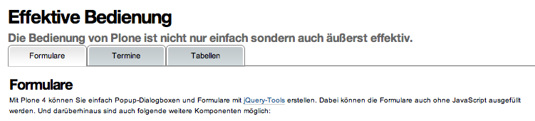

Fraunhofer-ISE: Projekt-Site
============================

Für das `Fraunhofer-Institut für Solare Energiesysteme ISE
<http://www.ise.fraunhofer.de/de>`_ erstellten wir eine Projektsite, deren
Module auch in weiteren Projektsites verwendet werden können.

Realisation
-----------

Umsetzung des Styleguides mit folgenden funktionalen Erweiterungen:

- Reiternavigation auf Basis von `vs.tdi
  <http://www.veit-schiele.de/produkte/vs.tdi>`_.

Zusammen mit den für andere Websites des Fraunhofer-Institut für Solare
Energiesysteme ISE entwickelten Modulen `vs.contentpopup
<http://www.veit-schiele.de/produkte/vs.contentpopup>`_, `vs.contentnavigation
<http://www.veit-schiele.de/produkte/vs.contentnavigation>`_ und
`vs.jquerybookmarks <http://www.veit-schiele.de/produkte/vs.jquerybookmarks>`_
entsteht so ein Baukasten, der einfach für weitere Projektsites des Fraunhofer
ISE verwendet werden kann.
