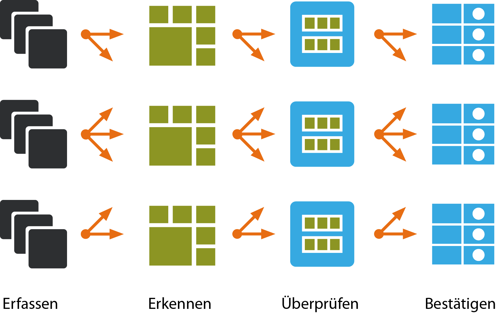

Pydica: Python-based Distributed Document Capture
=================================================

Januar 2012: Neuentwicklung eines verteilten Systems zur Erschließung von
Rezeptdaten für das Rechenzentrum für Berliner Apotheken Stein & Reichwald GmbH.

- `Pydica <https://bitbucket.org/pydica/pydica>`_
- `Rechenzentrum für Berliner Apotheken Stein & Reichwald GmbH
  <http://www.steinreichwald.de/>`_

Anforderungen
-------------

* Erstellen einer Plattform für verteiltes Scannen, Erkennen, automatisierte
  und manuelle Überprüfung
* Skalierbare Client-Server-Architektur
* Verteilung der Aufgaben
* Administration und Monitoring
* Effektive Bedienbarkeit

Konzeption
----------

Es werden einzelne Komponenten für folgende Bereiche entwickelt:

* Client zum Konfigurieren von Formularen, Validatoren und Ersetzungen
* Task-Manager
* OCR-Server
* Serverseitige Validierung der OCR-Dokumente
* Clientseitige Validierung der OCR-Dokumente

Realisierung
------------

* Das GUI wird mit Qt Designer erstellt.
* Die Gestaltung erfolgt durch CSS-Dateien
* `PySide <http://www.pyside.org/>`_ wird zur Anbindung an Python verwendet,
  wobei die Weiterentwicklung hybrid erfolgt:

  * das in PySide generierte Formular bleibt unverändert, sodass das User
    Interface gegebenenfalls mit QT-Designer weiterentwickelt werden kann
  * funktionale Erweiterungen werden grundsätzlich aus den Klassen und
    Methoden des generierten Formulars abgeleitet.

Weiterführende Informationen
----------------------------

`Tiffany-Repository <https://bitbucket.org/pydica/tiffany>`_
    Tiffany ist ein Sub-Projekt von PyDiCa. Es ist ein kleines Python-Modul,
    das das Lesen uns Schreiben von Multi-File-Tiffs erlaubt. Dabei kann
    Tiffany weder Bilddateien erstellen noch ändern, sondern nur bestehende
    *Pages* neu anordnen.
